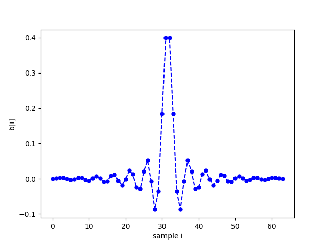
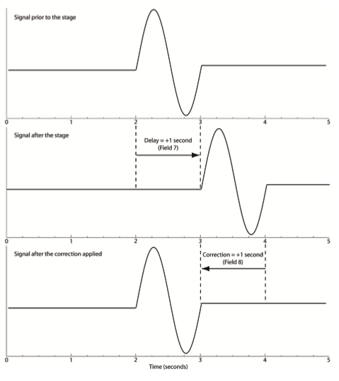

FIR anti-alias filter
^^^^^^^^^^^^^^^^^^^^^^^^^^^^^^^^^^^

The recommended practice for storing FIR filters is to
normalize the filter response at a specified frequency:

.. math::
   :nowrap:

   \begin{eqnarray}
      G(f)&=&S_d H_c(z)\Big|_{z=e^{j2\pi \Delta t f_s}} \\
          &=&S_d\sum_{k=0}^{M}b_k z^{-k} \Big|_{z=e^{j2\pi \Delta t f_s}} \\
          &=&S_d\sum_{n=0}^{M}b_k e^{-j 2\pi f_s k \Delta t}
   \end{eqnarray}

where :math:`b_k` are the FIR coefficients, :math:`M` is the filter order,
:math:`\Delta t` is the sample rate [seconds], and
:math:`f_s` is the frequency at which the filter is normalized
to have a gain of :math:`S_d`.

The Quanterra QDP380/QDP680 family of dataloggers
employ the 64-element FIR filter described
in Table X as a digital anti-alias filter
in the stage 4 decimation from 40Hz down to
20 Hz.

The FIR coefficients, :math:`b_k` are plotted in Fig. X

   Fig. X Plot of filter coefficients for Qx80 FIR filter

The FIR filter has 64 coefficients (order M = 64-1 = 63)
and is symmetric about the midpoint (which lies in between
samples 32 and 33).
Hence it is a FIR Type II symmetric filter.

Decimation
^^^^^^^^^^^^^^^^^^^^^^^^^^^^^^^^^^^

In the normal process by which the datalogger holds and samples information,
followed by decimation, a time delay is often introduced into the recorded
trace (see Fig. X). This delay, if known, can be stored in the <Delay> element.
For example, a delay of 1.0 seconds would be stored as:

.. code-block:: XML

      <Response>
         <Stage>
            <Decimation>
               <Delay>1.0</Delay>
            </Decimation>
         </Stage>
      </Response>

while any applied time correction, e.g., to cancel out the delay, can be stored in:

.. code-block:: XML

      <Response>
         <Stage>
            <Decimation>
               <Correction>1.0</Correction>
            </Decimation>
         </Stage>
      </Response>

An anti-alias FIR filter normally introduces a positive delay into the recorded trace
as indicated in the figure. If this delay is removed from the data,
e.g., by introducing a negative offset -x prior to recording, then the
positive value +x is stored in the <Correction> element.

