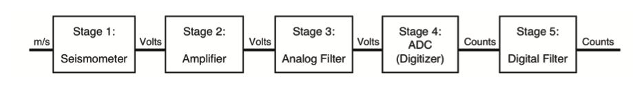
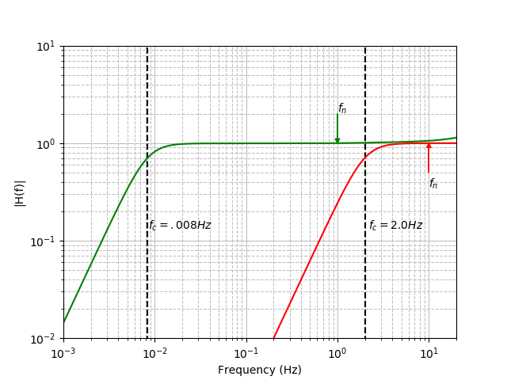

.. Put any comments here
   Be sure to indent at this level to keep it in comment.

Introduction
-----------------------------------------------

Geophysical data are recorded by an instrument that imparts its
own signature onto the data.
When the data are later analyzed, one of the first steps is to remove the effect
of the instrumentation used to record it, the so-called instrument response.
This is typically done in the frequency domain, by dividing the complex
Fourier Transform of the data by the complex Fourier Transform of the
instrument response.

.. math::

   Z(f)=\frac{X(f)}{I(f)}

where :math:`X(f)` is the Fourier Transform of the recorded time series,
:math:`I(f)` is the Fourier Transform of the instrument response,
and :math:`Z(f)` is the Fourier Transform of the data with the instrument response removed.

So how does one obtain the Fourier Transform of the instrument response?
Very often, this is calculated by combining the information describing
each stage of the instrument response in specific formats.

Sensor Response as a Linear Sequence of Stages
-----------------------------------------------

A recording system (sensor + datalogger) represents a linear, time-invariant system.
As such, the total response of the system (= the instrument response) can be
calculated by linearly combining the response of each individual stage in the system.
In the time domain, the operator that represents linear combination in this way is convolution,
however, it's difficult to visualize the result of convolving several stages together.
Fortunately, in the frequency domain, the operator that links the individual stage responses
together is multiplication, and it's trivial to combine stage responses together.

The schematic shown in the figure above represents a generic ideal of the
instrument response as a sequence of stages.  Where each stage is implemented
in the hardware, e.g., whether it physically resides in the sensor or the datalogger (or
whether these are integrated into a single unit) is not specified.

A more specific description of instrument response particular to most seismic instrumentation
is this:
The ground motion (typically velocity or acceleration) is "input" to the
seismic sensor which outputs continuous voltage (an analog signal) proportional to
the input in some way. This continuous voltage could then be amplified,
either by an external preamplifier (+ filter possibly) or, more commonly,
by circuitry within the datalogger itself.
Next, the continuous signal is sampled by the ADC (analog-to-digital conversion) circuit
of the datalogger, resulting in discrete data samples.

Typically, the sampling is done over a sequence of stages where the
first stage highly oversamples the input data.
Each subsequent stage is a combination of low-pass filter, typically implemented
using a FIR filter, followed by decimation of the data stream by some decimation
factor. This anti-alias FIR filter is necessary at each decimation step to avoid aliasing
of energy above the Nyquist frequency, which would contaminate the signal of interest.
This cascade of filter/decimate stages begins at the high sample rate
(e.g., 102400 samples per second for the Reftek RT130) and continues, with typical
integer decimation factors (2,4,5,8,10,16 etc) at each step, until the final desired output
sample rate is reached.
Thus, the input units of the first sensor stage is the ground motion (e.g., m/s),
while the input units of the first datalogger stage is Volts.
After the ADC, the input/output units for each subsequent stage is Counts.

Stage 1: The Analog Sensor
-----------------------------
The first stage of the response often represents the effect of an analog sensor (e.g., seismometer, microphone, etc),
which takes as input a physical quantity (e.g., ground motion in :math:`\mu ms^{-1}`, air pressure in :math:`Pa`, temperature
in :math:`^{\circ}C`, etc.)
and outputs Volts.

We need some way to represent how this sensor stage works and what distortion, if any,
it applies to the underlying time series (the input physical quantity).

Commonly, the analog sensor stage is stored as a sequence of poles and zeros of the Laplace Transform
(see Laplace Transform description above) along with associated scale factors.

Recall that the Laplace transform variable is given by :math:`s=\sigma+j\omega`.
Along the imaginary axis, :math:`\sigma=0` and hence :math:`s=j\omega`.
Thus, we may express the complex frequency response of the analog stage
by calculating its polezero expansion

.. math::

   H(f)=A_0\frac{\Pi_{k=1}^{M} (s-z_{k})} {\Pi_{k=1}^{N} (s-p_{k})}

where :math:`s=j2\pi f` [rad/s] or :math:`s=jf` [Hz] , :math:`z_k` are the
:math:`M` zeros and :math:`p_k` are the :math:`N` poles. :math:`A_0` is the normalization
factor, typically chosen so that :math:`|H(f_n)|=1.0` where :math:`f_n` is the normalization
frequency.

Thus, given the poles and zeros of an analog stage,
in order to properly calculate the stage frequency response,
we must know the units of :math:`s` (Hz or rad/s) used to calculate the poles and zeros
using the expansion above.

With the normalization factor :math:`A_0`, the polezero expansion results in a
complex frequency response with magnitude = 1.0 at the normalization frequency.
For seismometers whose response is flat to ground velocity,
the normalization frequency is typically chosen somewhere within the
flat part of the response spectrum.
For broadband sensors, it is also considered good practice to
select a normalization frequency lower than
two times the lowest sampling frequency.
For example, if you are sampling VHZ data at 0.1 sps, then you want to
describe :math:`A_0` at a frequency :math:`\lt 0.05` Hz.

Thus, the poles and zeros give the shape of the sensor response,
but not the gain (see Fig. X below).

..
   The actual gain of the sensor (e.g., the conversion factor from ground motion to Volts)
   is specified within a <StageGain> element (see example below).

Analog polezero examples
^^^^^^^^^^^^^^^^^^^^^^^^^^^^^^^^^^

Below are the poles and zeros for two broadband seismometers (STS-1 and STS-2)
and a short-period sensor (L-22D). All have a response that is flat to velocity
within some frequency band, which is controlled by the location of the poles
and zeros in the :math:`s`-plane.

.. include:: pz_table_sts-2.rst

.. include:: pz_table_sts-1.rst

.. include:: pz_table_l-22d.rst

Notice from the table above that the poles always appear in
complex conjugate pairs (in the degenerate case this is represented
by a single real pole).
This will always be the case, since
the poles and zeros ultimately relate to a polynomial expression
with real coefficients that describes the seismometer response.
In addition, notice that all of the poles have a negative real part.
This is required for stability reasons as discussed in the theory
section above.

The poles and zeros have units in the
complex s-plane. For the examples given (and for most analog stages),
<PzTransferFunctionType> is "LAPLACE (RADIANS/SECOND)", hence the
poles and zeros have units of rad/s.

When viewing the total instrument response as a plot of amplitude and phase versus frequency,
most of the shape is controlled by the polezero expansion of the analog sensor stage.

   Fig. X Plot of polezero expansion of analog sensor for Streckeisen STS-2 (green)
   and Sercel L-22D (red) [see table for polezero values used].

In the figure above we plot the analog stage polezero expansion for a broadband
seismometer (STS-2) and a short-period seismometer (L-22D).
In both cases, the A0 normalization frequency, :math:`f_n` is located within the
flat part of the spectrum, and each response has a corner frequency, :math:`f_c`
below which the magnitude response rolls off.  The corner frequency is the
frequency at which the response magnitude is -3dB below the flat part of the spectrum.

Given the poles and zeros, one can determine the low-frequency corner frequency, :math:`f_c`,
from the magnitude of the lowest frequency pole in the s-plane.

For instance, for the STS-2 example shown, the lowest frequency pole is at
:math:`-.037 \pm .037j` in the complex s-plane, and the corresponding
corner frequency is:

.. math::

   \omega = \sqrt{.037^2 + .037^2} = \sqrt{2} \times .037 = .052326 rad/s

   f_c =  \frac{\omega}{2\pi} = 0.0083279 s^{-1} \rightarrow T_c = 1/f_c = 120 sec

As expected, the STS-2 sensor has a corner *period* of 120 s.

By similar reasoning, the corner frequency of the short-period L-22D sensor is

.. math::

   \omega = \sqrt{8.884^2 + 8.887^2} = 12.566 rad/s

   f_c =  \frac{\omega}{2\pi} = 2.0 Hz

For many applications the exact instrument response is not needed and it is
sufficient to calculate a single scale factor to convert from recorded COUNTS
to ground motion (e.g, M/S).  For instance, if the signal of interest only
contains energy within the flat part of the spectrum (e.g., band-limited signal),
then we might be able to ignore the polezero shape altogether and compute
and overall scale factor (to go from COUNTS to M/S) for the sensor + datalogger.

For instance, if the STS-2 sensor discussed above were connected to a generic
Reftek RT-130 datalogger, we can calculate an approximate forward scale factor:

.. math::

   1500 [V/m/s] \times 6.291290\times 10^{5} [Counts/V] = 9.4369\times 10^{8} [Counts/m/s]

While this is often done to do a quick conversion to ground velocity, several
caveats must be mentioned.

   #. Very few signals are truly bandlimited this way and we're essentially applying the
      wrong correction factor to the signals outside the bandwidth

   #. Often, the frequency at which the sensor response is normalized, is not the same
      as the frequency at which the datalogger response is normalized.
      For instance, the Reftek RT-130 is normalized at 0.05 Hz, while the STS-2 is
      normalized at 1.0 Hz.
      This matters because the amplitude response of the datalogger filters are not perfectly flat,
      hence to compute the overall instrument response (sensor + datalogger), the
      datalogger gain often has to be recalculated at the frequency of the sensor normalization.

   #. It ignores the phase response, which can be very important for modeling waveforms, etc.

Alternatively, when simple scaling is insufficient, it is necessary to use all of the
response stages to compute the exact instrument response.
When the datalogger normalization frequency is different from the sensor normalization
frequency, the datalogger response is *recalculated* at the sensor normalization frequency
and the new *sensitivity*, equal to the product of each stage amplitude response at
this normalization frequency, is stored in the StationXML <InstrumentSensitivity> element.

Converting s = rad/s to/from Hz
^^^^^^^^^^^^^^^^^^^^^^^^^^^^^^^^^^^^^^^^^

Recall the polezero expansion of the Laplace Transform of the transfer function,

.. math::

   H(s)=A_{0}\frac{\Pi_{k=1}^{M}(s-z_{k})}{\Pi_{k=1}^{N}(s-p_{k})}

Consider a system with 1 zero and 2 poles (forming a complex conjugate pair)
in the complex :math:`s`-plane (rad/s).
Say :math:`z_{1}=z_{r}+jz_{i}`, :math:`p_{1}=p_{r}+jp_{i}` and :math:`p_2=\bar{p_1}`,
where each term :math:`z_r, z_i, p_r, p_i` has units of rad/s.

Then

.. math::
   :nowrap:

   \begin{eqnarray}
      H(s=j\omega)&=&A_{0}\frac{j\omega-(z_{r}+jz_{i})}{(j\omega-p_{1})(j\omega-\bar{p_{1}})} \\
      &=&A_{0}\frac{2\pi[jf-(z_{r}^{'}+jz_{i}^{'})]}{(2\pi)^{2}[(jf-p_{1}^{'})(jf-\bar{p_{1}^{'}})]} \\
   \end{eqnarray}

where the primed quantities equal the unprimed quantities divide by :math:`2\pi`,
e.g., :math:`z_r^{'}=\frac{z_r}{2\pi}`

We can write this as

.. math::

   H(s=jf)=A_{0}^{'}\frac{[jf-(z_{r}^{'}+jz_{i}^{'})]}{[(jf-p_{1}^{'})(jf-\bar{p_{1}^{'}})]}

where :math:`A_{0}^{'}=\frac{2\pi}{(2\pi)^{2}}A_0`.

In general, we can write

.. math::

   H(s=jf)=A_{0}^{'}\frac{\Pi_{k=1}^{M}(jf-z_{k}^{'})}{\Pi_{k=1}^{N}(jf-p_{k}^{'})}

where :math:`A_{0}^{'}=A_{0}\cdot(2\pi)^{M-N}` and where :math:`M` is the number of
zeros and :math:`N` is the number of poles.

Thus, if we are given a polezero stage with units of rad/s (:math:`\omega`),
we can convert this stage to units of Hz and maintain the proper normalization
by first dividing each pole and zero by :math:`2\pi`,
and then scaling the normalization factor
:math:`A_{0}` by :math:`(2\pi)^{M-N}`.

Conversely, if we are given a polezero stage with units of Hz (:math:`f`),
we can convert it to units of rad/s by first multiplying the each pole
and zero by :math:`2\pi`,
and then scaling the given normalization factor
:math:`A_{0}^{'}` by :math:`(2\pi)^{N-M}`.

For example, the poles and zeros of the Streckeisen STS-I sensor are shown
in the table below for units = Hz (<PzTransferFunctionType>LAPLACE (HERTZ)</PzTransferFunctionType>)

.. include:: pz_table_sts-1_Hz.rst

Stage 2: The Preamplifier
-----------------------------
Not all response sequences have a preamplifier. When present, it may be implemented using
an analog circuit (V->V) or it may be a digital circuit integrated within the analog-to-digital
(datalogger) recorder itself.

For example, an analog preamplifier stage with a gain of 8 would be represented as:

.. code-block:: XML

   <Stage number="2">
      <StageGain>
         <Value>8</Value>
         <Frequency>1</Frequency>
      </StageGain>
   </Stage>

where the <Frequency> is normally chosen to be the same as the normalization frequency, :math:`f_n` in stage 1.

An external preamplifier stage could have an associated filter, either implemented using a polezero or
coefficient representation.

Often, the preamplifier is integrated with the datalogger and merely adds a uniform scale factor to
the instrument response.

.. admonition:: Warning

   Using *place-holder* pre-amps at stage 2 may not be good practice.

Some entities (e.g., the Nominal Response Library or NRL)
always include a pre-amp at stage 2 in order to
standardize the numbering of response stages
(e.g., so that the datalogger response always begins at stage 3).
If no pre-amp was actually present, then a *place-holder* stage
with gain=1 is used.

However, there is disagreement about whether *all* responses should have
such a place-holder stage or whether it is better practice
to have the response stages more faithfully correspond to the equipment
that is actually used.

Stage 2+: The Datalogger
-----------------------------

The datalogger, or analog-to-digital converter (ADC)
has two main functions: 1. To digitize the analog signal (Volts)
coming from the sensor and 2. To output the digitized
signal (digital counts) at the desired sample rate(s).

These functions are typically achieved by first highly oversampling the
analog signal, and then passing it through a sequence of filter/decimate
steps to achieve the desired output sample rate(s).

Each filter/decimate step is represented by a stage in the StationXML response,
representing the effects of low-pass filtering (typically implemented
with an anti-alias FIR filter) and decimation to a lower sample rate.

.. include:: filters.rst
