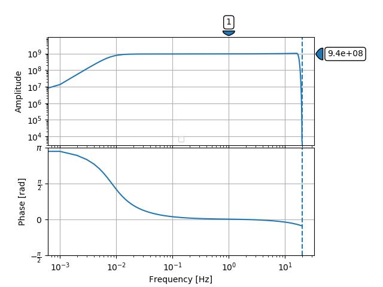

.. Put any comments here
   Be sure to indent at this level to keep it in comment.

As StationXML files are ordinary ascii files, they may be editted with 
any text editor (e.g., vi/VIM, TextWrangler, Notepad/Wordpad, etc) 

However, StationXML files can become very large and unwieldly as more 
stations and channels are added.  For instance a regional seismic network
can generate a StationXML file of size > 30Mb on disk (>400,000 lines).

Fortunately, several tools exist that allow creation and editting of
StationXML files.

obspy + NRL
==============

ObsPy contains a number of very useful modules for working with StationXML.
In particular, ObsPy contain a module able to connect
to the IRIS Nominal Resource Library (NRL) and 
download full responses (sensor + datalogger) for various combinations
of sensor + datalogger contained within the NRL.

The excerpts below provide examples of how to work with ObsPy and the NRL.

    ::

      from obspy.clients.nrl import NRL

      from lib.valid import stationxml_validator

      def main():

         nrl = NRL('http://ds.iris.edu/NRL/')
         datalogger_keys = ['REF TEK', 'RT 130 & 130-SMA', '1', '40']
         sensor_keys = ['Streckeisen', 'STS-2', '1500', '3 - installed 04/97 to present']

         response = nrl.get_response(sensor_keys=sensor_keys, datalogger_keys=datalogger_keys)

         response.plot(min_freq=.001)

         for stage in response.response_stages:
            print(stage)

The resulting response plot looks like

.. toggle-header::
    :header: Output for the response stages **Show/Hide Stages**

    ::

      <?xml version='1.0' encoding='UTF-8'?>

      Response type: PolesZerosResponseStage, Stage Sequence Number: 1
	    From M/S (Velocity in Meters per Second) to V (Volts)
	    Stage gain: 1500.0, defined at 1.00 Hz
	    Transfer function type: LAPLACE (RADIANS/SECOND)
	    Normalization factor: 3.4684e+17, Normalization frequency: 1.00 Hz
	    Poles: (-0.037-0.037j), (-0.037+0.037j), (-15.64+0j), (-97.34-400.7j), (-97.34+400.7j), (-374.8+0j), (-520.3+0j), (-10530-10050j), (-10530+10050j), (-13300+0j), (-255.097+0j)
	    Zeros: 0j, 0j, (-15.15+0j), (-176.6+0j), (-463.1-430.5j), (-463.1+430.5j)
      Response type: ResponseStage, Stage Sequence Number: 2
	    From V to V
	    Stage gain: 1.0, defined at 0.05 Hz
      Response type: CoefficientsTypeResponseStage, Stage Sequence Number: 3
	    From V (Volts) to COUNTS (Digital Counts)
	    Stage gain: 629129.0, defined at 0.05 Hz
	    Decimation:
		     Input Sample Rate: 102400.00 Hz
		     Decimation Factor: 1
		     Decimation Offset: 0
		     Decimation Delay: 0.00
		     Decimation Correction: 0.00
	    Transfer function type: DIGITAL
	    Contains 1 numerators and 0 denominators
      Response type: CoefficientsTypeResponseStage, Stage Sequence Number: 4
	    From COUNTS (Digital Counts) to COUNTS (Digital Counts)
	    Stage gain: 1.0, defined at 0.05 Hz
	    Decimation:
		     Input Sample Rate: 102400.00 Hz
		     Decimation Factor: 8
		     Decimation Offset: 0
		     Decimation Delay: 0.00
		     Decimation Correction: 0.00
	    Transfer function type: DIGITAL
	    Contains 29 numerators and 0 denominators
      Response type: CoefficientsTypeResponseStage, Stage Sequence Number: 5
	    From COUNTS (Digital Counts) to COUNTS (Digital Counts)
	    Stage gain: 1.0, defined at 0.05 Hz
	    Decimation:
		     Input Sample Rate: 12800.00 Hz
		     Decimation Factor: 2
		     Decimation Offset: 0
		     Decimation Delay: 0.00
		     Decimation Correction: 0.00
	    Transfer function type: DIGITAL
	    Contains 13 numerators and 0 denominators
      Response type: CoefficientsTypeResponseStage, Stage Sequence Number: 6
	    From COUNTS (Digital Counts) to COUNTS (Digital Counts)
	    Stage gain: 1.0, defined at 0.05 Hz
	    Decimation:
		     Input Sample Rate: 6400.00 Hz
		     Decimation Factor: 2
		     Decimation Offset: 0
		     Decimation Delay: 0.00
		     Decimation Correction: 0.00
	    Transfer function type: DIGITAL
	    Contains 13 numerators and 0 denominators
      Response type: CoefficientsTypeResponseStage, Stage Sequence Number: 7
	    From COUNTS (Digital Counts) to COUNTS (Digital Counts)
	    Stage gain: 1.0, defined at 0.05 Hz
	    Decimation:
		     Input Sample Rate: 3200.00 Hz
		     Decimation Factor: 2
		     Decimation Offset: 0
		     Decimation Delay: 0.00
		     Decimation Correction: 0.00
	    Transfer function type: DIGITAL
	    Contains 13 numerators and 0 denominators
      Response type: CoefficientsTypeResponseStage, Stage Sequence Number: 8
	    From COUNTS (Digital Counts) to COUNTS (Digital Counts)
	    Stage gain: 1.0, defined at 0.05 Hz
	    Decimation:
		     Input Sample Rate: 1600.00 Hz
		     Decimation Factor: 2
		     Decimation Offset: 0
		     Decimation Delay: 0.00
		     Decimation Correction: 0.00
	    Transfer function type: DIGITAL
	    Contains 13 numerators and 0 denominators
      Response type: CoefficientsTypeResponseStage, Stage Sequence Number: 9
	    From COUNTS (Digital Counts) to COUNTS (Digital Counts)
	    Stage gain: 1.0, defined at 0.05 Hz
	    Decimation:
		     Input Sample Rate: 800.00 Hz
		     Decimation Factor: 2
		     Decimation Offset: 0
		     Decimation Delay: 0.01
		     Decimation Correction: 0.01
	    Transfer function type: DIGITAL
	    Contains 13 numerators and 0 denominators
      Response type: CoefficientsTypeResponseStage, Stage Sequence Number: 10
	    From COUNTS (Digital Counts) to COUNTS (Digital Counts)
	    Stage gain: 1.0, defined at 0.05 Hz
	    Decimation:
		     Input Sample Rate: 400.00 Hz
		     Decimation Factor: 2
		     Decimation Offset: 0
		     Decimation Delay: 0.12
		     Decimation Correction: 0.12
	    Transfer function type: DIGITAL
	    Contains 101 numerators and 0 denominators
      Response type: CoefficientsTypeResponseStage, Stage Sequence Number: 11
	    From COUNTS (Digital Counts) to COUNTS (Digital Counts)
	    Stage gain: 1.0, defined at 0.05 Hz
	    Decimation:
		     Input Sample Rate: 200.00 Hz
		     Decimation Factor: 5
		     Decimation Offset: 0
		     Decimation Delay: 0.58
		     Decimation Correction: 0.58
	    Transfer function type: DIGITAL
	    Contains 235 numerators and 0 denominators

Up until now we've been examining the response in ObsPy format, that is, as an instance
of type obspy.core.inventory.response.Response.

We can also examine this as part of a StationXML file, however, StationXML
does not allow children to exist without parents.  Thus, a response must
be contained within a <Channel> element, which itself must be contained
within a <Station> element, which must be contained within a <Network>
element, etc.

The excerpt below creates a generic structure to contain our Response object,
exports this to StationXML, and validates it against the StationXML schema.

    ::

      from obspy.clients.nrl import NRL

         ...

         inventory = Inventory(networks=[], source="demo")
         network = Network(code='US')
         station = Station(code='ANMO',
                            latitude=34.945911,
                            longitude=-106.457199,
                            elevation=1820.0,
                            creation_date=UTCDateTime(1970, 1, 1),          # required
                            site=Site(name='Albuquerque, New Mexico, USA')  # required
                            )

         channel = Channel(code='BHZ',
                            location_code='10',      # required
                            latitude=34.945911,      # required
                            longitude=-106.457199,   # required
                            elevation=1820.0,        # required
                            depth=0.,                # required
                            )

         channel.response = response

         inventory.write("Test.xml", format="stationxml", validate=False)

.. toggle-header::
    :header: The output StationXML file looks like:

    ::

      <?xml version='1.0' encoding='UTF-8'?>

      Response type: PolesZerosResponseStage, Stage Sequence Number: 1

      <?xml version='1.0' encoding='UTF-8'?>
      <FDSNStationXML xmlns="http://www.fdsn.org/xml/station/1" schemaVersion="1.0">
      <Source>demo</Source>
      <Module>ObsPy 1.1.0</Module>
      <ModuleURI>https://www.obspy.org</ModuleURI>
      <Created>2020-02-07T22:26:54.123236</Created>
      <Network code="US">
         <Station code="ANMO">
            <Latitude unit="DEGREES">34.945911</Latitude>
            <Longitude unit="DEGREES">-106.457199</Longitude>
            <Elevation unit="METERS">1820.0</Elevation>
            <Site>
            <Name>Albuquerque, New Mexico, USA</Name>
            </Site>
            <CreationDate>1970-01-01T00:00:00</CreationDate>
            <Channel code="BHZ" locationCode="10">
            <Latitude unit="DEGREES">34.945911</Latitude>
            <Longitude unit="DEGREES">-106.457199</Longitude>
            <Elevation unit="METERS">1820.0</Elevation>
            <Depth unit="METERS">0.0</Depth>
            <Response>
               <InstrumentSensitivity>
                  <Value>941864732.6931986</Value>
                  <Frequency>1.0</Frequency>
                  <InputUnits>
                  <Name>M/S</Name>
                  <Description>Velocity in Meters per Second</Description>
                  </InputUnits>
                  <OutputUnits>
                  <Name>COUNTS</Name>
                  <Description>Digital Counts</Description>
                  </OutputUnits>
               </InstrumentSensitivity>
               <Stage number="1">
                  <PolesZeros>
                  <InputUnits>
                     <Name>M/S</Name>
                     <Description>Velocity in Meters per Second</Description>
                  </InputUnits>
                  <OutputUnits>
                     <Name>V</Name>
                     <Description>Volts</Description>
                  </OutputUnits>
                  <PzTransferFunctionType>LAPLACE (RADIANS/SECOND)</PzTransferFunctionType>
                  <NormalizationFactor>3.4684e+17</NormalizationFactor>
                  <NormalizationFrequency unit="HERTZ">1.0</NormalizationFrequency>
                  <Zero number="0">
                     <Real minusError="0.0" plusError="0.0">0.0</Real>
                     <Imaginary minusError="0.0" plusError="0.0">0.0</Imaginary>
                  </Zero>
                  <Zero number="1">
                     <Real minusError="0.0" plusError="0.0">0.0</Real>
                     <Imaginary minusError="0.0" plusError="0.0">0.0</Imaginary>
                  </Zero>
                  <Zero number="2">
                     <Real minusError="-15.15" plusError="-15.15">-15.15</Real>
                     <Imaginary minusError="0.0" plusError="0.0">0.0</Imaginary>
                  </Zero>
                  <Zero number="3">
                     <Real minusError="-176.6" plusError="-176.6">-176.6</Real>
                     <Imaginary minusError="0.0" plusError="0.0">0.0</Imaginary>
                  </Zero>
                  <Zero number="4">
                     <Real minusError="-463.1" plusError="-463.1">-463.1</Real>
                     <Imaginary minusError="-430.5" plusError="-430.5">-430.5</Imaginary>
                  </Zero>
                  <Zero number="5">
                     <Real minusError="-463.1" plusError="-463.1">-463.1</Real>
                     <Imaginary minusError="430.5" plusError="430.5">430.5</Imaginary>
                  </Zero>
                  <Pole number="0">
                     <Real minusError="-0.037" plusError="-0.037">-0.037</Real>
                     <Imaginary minusError="-0.037" plusError="-0.037">-0.037</Imaginary>
                  </Pole>
                  <Pole number="1">
                     <Real minusError="-0.037" plusError="-0.037">-0.037</Real>
                     <Imaginary minusError="0.037" plusError="0.037">0.037</Imaginary>
                  </Pole>
                  <Pole number="2">
                     <Real minusError="-15.64" plusError="-15.64">-15.64</Real>
                     <Imaginary minusError="0.0" plusError="0.0">0.0</Imaginary>
                  </Pole>
                  <Pole number="3">
                     <Real minusError="-97.34" plusError="-97.34">-97.34</Real>
                     <Imaginary minusError="-400.7" plusError="-400.7">-400.7</Imaginary>
                  </Pole>
                  <Pole number="4">
                     <Real minusError="-97.34" plusError="-97.34">-97.34</Real>
                     <Imaginary minusError="400.7" plusError="400.7">400.7</Imaginary>
                  </Pole>
                  <Pole number="5">
                     <Real minusError="-374.8" plusError="-374.8">-374.8</Real>
                     <Imaginary minusError="0.0" plusError="0.0">0.0</Imaginary>
                  </Pole>
                  <Pole number="6">
                     <Real minusError="-520.3" plusError="-520.3">-520.3</Real>
                     <Imaginary minusError="0.0" plusError="0.0">0.0</Imaginary>
                  </Pole>
                  <Pole number="7">
                     <Real minusError="-10530.0" plusError="-10530.0">-10530.0</Real>
                     <Imaginary minusError="-10050.0" plusError="-10050.0">-10050.0</Imaginary>
                  </Pole>
                  <Pole number="8">
                     <Real minusError="-10530.0" plusError="-10530.0">-10530.0</Real>
                     <Imaginary minusError="10050.0" plusError="10050.0">10050.0</Imaginary>
                  </Pole>
                  <Pole number="9">
                     <Real minusError="-13300.0" plusError="-13300.0">-13300.0</Real>
                     <Imaginary minusError="0.0" plusError="0.0">0.0</Imaginary>
                  </Pole>
                  <Pole number="10">
                     <Real minusError="-255.097" plusError="-255.097">-255.097</Real>
                     <Imaginary minusError="0.0" plusError="0.0">0.0</Imaginary>
                  </Pole>
                  </PolesZeros>
                  <StageGain>
                  <Value>1500.0</Value>
                  <Frequency>1.0</Frequency>
                  </StageGain>
               </Stage>
               <Stage number="2">
                  <StageGain>
                  <Value>1.0</Value>
                  <Frequency>0.05</Frequency>
                  </StageGain>
               </Stage>
               <Stage number="3">
                  <Coefficients>
                  <InputUnits>
                     <Name>V</Name>
                     <Description>Volts</Description>
                  </InputUnits>
                  <OutputUnits>
                     <Name>COUNTS</Name>
                     <Description>Digital Counts</Description>
                  </OutputUnits>
                  <CfTransferFunctionType>DIGITAL</CfTransferFunctionType>
                  <Numerator>1.0</Numerator>
                  </Coefficients>
                  <Decimation>
                  <InputSampleRate unit="HERTZ">102400.0</InputSampleRate>
                  <Factor>1</Factor>
                  <Offset>0</Offset>
                  <Delay>0.0</Delay>
                  <Correction>0.0</Correction>
                  </Decimation>
                  <StageGain>
                  <Value>629129.0</Value>
                  <Frequency>0.05</Frequency>
                  </StageGain>
               </Stage>
               <Stage number="4">
                  <Coefficients>
                  <InputUnits>
                     <Name>COUNTS</Name>
                     <Description>Digital Counts</Description>
                  </InputUnits>
                  <OutputUnits>
                     <Name>COUNTS</Name>
                     <Description>Digital Counts</Description>
                  </OutputUnits>
                  <CfTransferFunctionType>DIGITAL</CfTransferFunctionType>
                  <Numerator>0.000244141</Numerator>
                  <Numerator>0.000976562</Numerator>
                  <Numerator>0.00244141</Numerator>
                  <Numerator>0.00488281</Numerator>
                  <Numerator>0.00854492</Numerator>
                  <Numerator>0.0136719</Numerator>
                  <Numerator>0.0205078</Numerator>
                  <Numerator>0.0292969</Numerator>
                  <Numerator>0.0393066</Numerator>
                  <Numerator>0.0498047</Numerator>
                  <Numerator>0.0600586</Numerator>
                  <Numerator>0.0693359</Numerator>
                  <Numerator>0.0769043</Numerator>
                  <Numerator>0.0820312</Numerator>
                  <Numerator>0.0839844</Numerator>
                  <Numerator>0.0820312</Numerator>
                  <Numerator>0.0769043</Numerator>
                  <Numerator>0.0693359</Numerator>
                  <Numerator>0.0600586</Numerator>
                  <Numerator>0.0498047</Numerator>
                  <Numerator>0.0393066</Numerator>
                  <Numerator>0.0292969</Numerator>
                  <Numerator>0.0205078</Numerator>
                  <Numerator>0.0136719</Numerator>
                  <Numerator>0.00854492</Numerator>
                  <Numerator>0.00488281</Numerator>
                  <Numerator>0.00244141</Numerator>
                  <Numerator>0.000976562</Numerator>
                  <Numerator>0.000244141</Numerator>
                  </Coefficients>
                  <Decimation>
                  <InputSampleRate unit="HERTZ">102400.0</InputSampleRate>
                  <Factor>8</Factor>
                  <Offset>0</Offset>
                  <Delay>0.00013672</Delay>
                  <Correction>0.00013672</Correction>
                  </Decimation>
                  <StageGain>
                  <Value>1.0</Value>
                  <Frequency>0.05</Frequency>
                  </StageGain>
               </Stage>
               <Stage number="5">
                  <Coefficients>
                  <InputUnits>
                     <Name>COUNTS</Name>
                     <Description>Digital Counts</Description>
                  </InputUnits>
                  <OutputUnits>
                     <Name>COUNTS</Name>
                     <Description>Digital Counts</Description>
                  </OutputUnits>
                  <CfTransferFunctionType>DIGITAL</CfTransferFunctionType>
                  <Numerator>0.000244141</Numerator>
                  <Numerator>0.00292969</Numerator>
                  <Numerator>0.0161133</Numerator>
                  <Numerator>0.0537109</Numerator>
                  <Numerator>0.12085</Numerator>
                  <Numerator>0.193359</Numerator>
                  <Numerator>0.225586</Numerator>
                  <Numerator>0.193359</Numerator>
                  <Numerator>0.12085</Numerator>
                  <Numerator>0.0537109</Numerator>
                  <Numerator>0.0161133</Numerator>
                  <Numerator>0.00292969</Numerator>
                  <Numerator>0.000244141</Numerator>
                  </Coefficients>
                  <Decimation>
                  <InputSampleRate unit="HERTZ">12800.0</InputSampleRate>
                  <Factor>2</Factor>
                  <Offset>0</Offset>
                  <Delay>0.00046875</Delay>
                  <Correction>0.00046875</Correction>
                  </Decimation>
                  <StageGain>
                  <Value>1.0</Value>
                  <Frequency>0.05</Frequency>
                  </StageGain>
               </Stage>
               <Stage number="6">
                  <Coefficients>
                  <InputUnits>
                     <Name>COUNTS</Name>
                     <Description>Digital Counts</Description>
                  </InputUnits>
                  <OutputUnits>
                     <Name>COUNTS</Name>
                     <Description>Digital Counts</Description>
                  </OutputUnits>
                  <CfTransferFunctionType>DIGITAL</CfTransferFunctionType>
                  <Numerator>0.000244141</Numerator>
                  <Numerator>0.00292969</Numerator>
                  <Numerator>0.0161133</Numerator>
                  <Numerator>0.0537109</Numerator>
                  <Numerator>0.12085</Numerator>
                  <Numerator>0.193359</Numerator>
                  <Numerator>0.225586</Numerator>
                  <Numerator>0.193359</Numerator>
                  <Numerator>0.12085</Numerator>
                  <Numerator>0.0537109</Numerator>
                  <Numerator>0.0161133</Numerator>
                  <Numerator>0.00292969</Numerator>
                  <Numerator>0.000244141</Numerator>
                  </Coefficients>
                  <Decimation>
                  <InputSampleRate unit="HERTZ">6400.0</InputSampleRate>
                  <Factor>2</Factor>
                  <Offset>0</Offset>
                  <Delay>0.0009375</Delay>
                  <Correction>0.0009375</Correction>
                  </Decimation>
                  <StageGain>
                  <Value>1.0</Value>
                  <Frequency>0.05</Frequency>
                  </StageGain>
               </Stage>
               <Stage number="7">
                  <Coefficients>
                  <InputUnits>
                     <Name>COUNTS</Name>
                     <Description>Digital Counts</Description>
                  </InputUnits>
                  <OutputUnits>
                     <Name>COUNTS</Name>
                     <Description>Digital Counts</Description>
                  </OutputUnits>
                  <CfTransferFunctionType>DIGITAL</CfTransferFunctionType>
                  <Numerator>0.000244141</Numerator>
                  <Numerator>0.00292969</Numerator>
                  <Numerator>0.0161133</Numerator>
                  <Numerator>0.0537109</Numerator>
                  <Numerator>0.12085</Numerator>
                  <Numerator>0.193359</Numerator>
                  <Numerator>0.225586</Numerator>
                  <Numerator>0.193359</Numerator>
                  <Numerator>0.12085</Numerator>
                  <Numerator>0.0537109</Numerator>
                  <Numerator>0.0161133</Numerator>
                  <Numerator>0.00292969</Numerator>
                  <Numerator>0.000244141</Numerator>
                  </Coefficients>
                  <Decimation>
                  <InputSampleRate unit="HERTZ">3200.0</InputSampleRate>
                  <Factor>2</Factor>
                  <Offset>0</Offset>
                  <Delay>0.001875</Delay>
                  <Correction>0.001875</Correction>
                  </Decimation>
                  <StageGain>
                  <Value>1.0</Value>
                  <Frequency>0.05</Frequency>
                  </StageGain>
               </Stage>
               <Stage number="8">
                  <Coefficients>
                  <InputUnits>
                     <Name>COUNTS</Name>
                     <Description>Digital Counts</Description>
                  </InputUnits>
                  <OutputUnits>
                     <Name>COUNTS</Name>
                     <Description>Digital Counts</Description>
                  </OutputUnits>
                  <CfTransferFunctionType>DIGITAL</CfTransferFunctionType>
                  <Numerator>0.000244141</Numerator>
                  <Numerator>0.00292969</Numerator>
                  <Numerator>0.0161133</Numerator>
                  <Numerator>0.0537109</Numerator>
                  <Numerator>0.12085</Numerator>
                  <Numerator>0.193359</Numerator>
                  <Numerator>0.225586</Numerator>
                  <Numerator>0.193359</Numerator>
                  <Numerator>0.12085</Numerator>
                  <Numerator>0.0537109</Numerator>
                  <Numerator>0.0161133</Numerator>
                  <Numerator>0.00292969</Numerator>
                  <Numerator>0.000244141</Numerator>
                  </Coefficients>
                  <Decimation>
                  <InputSampleRate unit="HERTZ">1600.0</InputSampleRate>
                  <Factor>2</Factor>
                  <Offset>0</Offset>
                  <Delay>0.00375</Delay>
                  <Correction>0.00375</Correction>
                  </Decimation>
                  <StageGain>
                  <Value>1.0</Value>
                  <Frequency>0.05</Frequency>
                  </StageGain>
               </Stage>
               <Stage number="9">
                  <Coefficients>
                  <InputUnits>
                     <Name>COUNTS</Name>
                     <Description>Digital Counts</Description>
                  </InputUnits>
                  <OutputUnits>
                     <Name>COUNTS</Name>
                     <Description>Digital Counts</Description>
                  </OutputUnits>
                  <CfTransferFunctionType>DIGITAL</CfTransferFunctionType>
                  <Numerator>0.000244141</Numerator>
                  <Numerator>0.00292969</Numerator>
                  <Numerator>0.0161133</Numerator>
                  <Numerator>0.0537109</Numerator>
                  <Numerator>0.12085</Numerator>
                  <Numerator>0.193359</Numerator>
                  <Numerator>0.225586</Numerator>
                  <Numerator>0.193359</Numerator>
                  <Numerator>0.12085</Numerator>
                  <Numerator>0.0537109</Numerator>
                  <Numerator>0.0161133</Numerator>
                  <Numerator>0.00292969</Numerator>
                  <Numerator>0.000244141</Numerator>
                  </Coefficients>
                  <Decimation>
                  <InputSampleRate unit="HERTZ">800.0</InputSampleRate>
                  <Factor>2</Factor>
                  <Offset>0</Offset>
                  <Delay>0.0075</Delay>
                  <Correction>0.0075</Correction>
                  </Decimation>
                  <StageGain>
                  <Value>1.0</Value>
                  <Frequency>0.05</Frequency>
                  </StageGain>
               </Stage>
               <Stage number="10">
                  <Coefficients>
                  <InputUnits>
                     <Name>COUNTS</Name>
                     <Description>Digital Counts</Description>
                  </InputUnits>
                  <OutputUnits>
                     <Name>COUNTS</Name>
                     <Description>Digital Counts</Description>
                  </OutputUnits>
                  <CfTransferFunctionType>DIGITAL</CfTransferFunctionType>
                  <Numerator>-7.15032e-07</Numerator>
                  <Numerator>-5.60109e-06</Numerator>
                  <Numerator>-2.62179e-06</Numerator>
                  <Numerator>-4.31403e-05</Numerator>
                  <Numerator>-4.64771e-06</Numerator>
                  <Numerator>1.43006e-06</Numerator>
                  <Numerator>2.34769e-05</Numerator>
                  <Numerator>1.43006e-06</Numerator>
                  <Numerator>-5.27932e-05</Numerator>
                  <Numerator>-0.000366692</Numerator>
                  <Numerator>0.000376107</Numerator>
                  <Numerator>0.000854226</Numerator>
                  <Numerator>3.05081e-05</Numerator>
                  <Numerator>-0.00127621</Numerator>
                  <Numerator>-0.000910951</Numerator>
                  <Numerator>0.00127669</Numerator>
                  <Numerator>0.00215165</Numerator>
                  <Numerator>-0.000461554</Numerator>
                  <Numerator>-0.00333765</Numerator>
                  <Numerator>-0.00140933</Numerator>
                  <Numerator>0.00377072</Numerator>
                  <Numerator>0.00419414</Numerator>
                  <Numerator>-0.00264288</Numerator>
                  <Numerator>-0.00720121</Numerator>
                  <Numerator>-0.000644006</Numerator>
                  <Numerator>0.009184</Numerator>
                  <Numerator>0.00608445</Numerator>
                  <Numerator>-0.00857824</Numerator>
                  <Numerator>-0.0127401</Numerator>
                  <Numerator>0.00398225</Numerator>
                  <Numerator>0.0186261</Numerator>
                  <Numerator>0.0052052</Numerator>
                  <Numerator>-0.0209407</Numerator>
                  <Numerator>-0.0181629</Numerator>
                  <Numerator>0.0166669</Numerator>
                  <Numerator>0.0322447</Numerator>
                  <Numerator>-0.00346588</Numerator>
                  <Numerator>-0.0429528</Numerator>
                  <Numerator>-0.0193265</Numerator>
                  <Numerator>0.044309</Numerator>
                  <Numerator>0.0497909</Numerator>
                  <Numerator>-0.0294164</Numerator>
                  <Numerator>-0.0826078</Numerator>
                  <Numerator>-0.00934166</Numerator>
                  <Numerator>0.107552</Numerator>
                  <Numerator>0.0816604</Numerator>
                  <Numerator>-0.10311</Numerator>
                  <Numerator>-0.204208</Numerator>
                  <Numerator>-3.12231e-05</Numerator>
                  <Numerator>0.390432</Numerator>
                  <Numerator>0.589958</Numerator>
                  <Numerator>0.390432</Numerator>
                  <Numerator>-3.12231e-05</Numerator>
                  <Numerator>-0.204208</Numerator>
                  <Numerator>-0.10311</Numerator>
                  <Numerator>0.0816604</Numerator>
                  <Numerator>0.107552</Numerator>
                  <Numerator>-0.00934166</Numerator>
                  <Numerator>-0.0826078</Numerator>
                  <Numerator>-0.0294164</Numerator>
                  <Numerator>0.0497909</Numerator>
                  <Numerator>0.044309</Numerator>
                  <Numerator>-0.0193265</Numerator>
                  <Numerator>-0.0429528</Numerator>
                  <Numerator>-0.00346588</Numerator>
                  <Numerator>0.0322447</Numerator>
                  <Numerator>0.0166669</Numerator>
                  <Numerator>-0.0181629</Numerator>
                  <Numerator>-0.0209407</Numerator>
                  <Numerator>0.0052052</Numerator>
                  <Numerator>0.0186261</Numerator>
                  <Numerator>0.00398225</Numerator>
                  <Numerator>-0.0127401</Numerator>
                  <Numerator>-0.00857824</Numerator>
                  <Numerator>0.00608445</Numerator>
                  <Numerator>0.009184</Numerator>
                  <Numerator>-0.000644006</Numerator>
                  <Numerator>-0.00720121</Numerator>
                  <Numerator>-0.00264288</Numerator>
                  <Numerator>0.00419414</Numerator>
                  <Numerator>0.00377072</Numerator>
                  <Numerator>-0.00140933</Numerator>
                  <Numerator>-0.00333765</Numerator>
                  <Numerator>-0.000461554</Numerator>
                  <Numerator>0.00215165</Numerator>
                  <Numerator>0.00127669</Numerator>
                  <Numerator>-0.000910951</Numerator>
                  <Numerator>-0.00127621</Numerator>
                  <Numerator>3.05081e-05</Numerator>
                  <Numerator>0.000854226</Numerator>
                  <Numerator>0.000376107</Numerator>
                  <Numerator>-0.000366692</Numerator>
                  <Numerator>-0.00041031</Numerator>
                  <Numerator>2.52645e-05</Numerator>
                  <Numerator>0.000261821</Numerator>
                  <Numerator>0.000120602</Numerator>
                  <Numerator>-9.99854e-05</Numerator>
                  <Numerator>-0.000162312</Numerator>
                  <Numerator>-9.79595e-05</Numerator>
                  <Numerator>-2.94355e-05</Numerator>
                  <Numerator>-3.09847e-06</Numerator>
                  </Coefficients>
                  <Decimation>
                  <InputSampleRate unit="HERTZ">400.0</InputSampleRate>
                  <Factor>2</Factor>
                  <Offset>0</Offset>
                  <Delay>0.125</Delay>
                  <Correction>0.125</Correction>
                  </Decimation>
                  <StageGain>
                  <Value>1.0</Value>
                  <Frequency>0.05</Frequency>
                  </StageGain>
               </Stage>
               <Stage number="11">
                  <Coefficients>
                  <InputUnits>
                     <Name>COUNTS</Name>
                     <Description>Digital Counts</Description>
                  </InputUnits>
                  <OutputUnits>
                     <Name>COUNTS</Name>
                     <Description>Digital Counts</Description>
                  </OutputUnits>
                  <CfTransferFunctionType>DIGITAL</CfTransferFunctionType>
                  <Numerator>-1.09889e-05</Numerator>
                  <Numerator>-1.99798e-05</Numerator>
                  <Numerator>-3.29668e-05</Numerator>
                  <Numerator>-4.39561e-05</Numerator>
                  <Numerator>-4.79522e-05</Numerator>
                  <Numerator>-4.09589e-05</Numerator>
                  <Numerator>-1.8981e-05</Numerator>
                  <Numerator>1.8981e-05</Numerator>
                  <Numerator>6.7932e-05</Numerator>
                  <Numerator>0.000118881</Numerator>
                  <Numerator>0.000158842</Numerator>
                  <Numerator>0.000174826</Numerator>
                  <Numerator>0.000157843</Numerator>
                  <Numerator>0.000104895</Numerator>
                  <Numerator>2.49751e-05</Numerator>
                  <Numerator>-6.49352e-05</Numerator>
                  <Numerator>-0.00014086</Numerator>
                  <Numerator>-0.000178822</Numerator>
                  <Numerator>-0.00016084</Numerator>
                  <Numerator>-8.59142e-05</Numerator>
                  <Numerator>3.29668e-05</Numerator>
                  <Numerator>0.000163837</Numerator>
                  <Numerator>0.000268733</Numerator>
                  <Numerator>0.000310691</Numerator>
                  <Numerator>0.000263737</Numerator>
                  <Numerator>0.00013087</Numerator>
                  <Numerator>-6.09391e-05</Numerator>
                  <Numerator>-0.00026074</Numerator>
                  <Numerator>-0.000408593</Numerator>
                  <Numerator>-0.000448554</Numerator>
                  <Numerator>-0.000353648</Numerator>
                  <Numerator>-0.000135864</Numerator>
                  <Numerator>0.000155845</Numerator>
                  <Numerator>0.000438563</Numerator>
                  <Numerator>0.000623379</Numerator>
                  <Numerator>0.000638365</Numerator>
                  <Numerator>0.000456546</Numerator>
                  <Numerator>0.000108891</Numerator>
                  <Numerator>-0.000315686</Numerator>
                  <Numerator>-0.000694309</Numerator>
                  <Numerator>-0.000903101</Numerator>
                  <Numerator>-0.00085415</Numerator>
                  <Numerator>-0.000533469</Numerator>
                  <Numerator>-7.99164e-06</Numerator>
                  <Numerator>0.000581421</Numerator>
                  <Numerator>0.00105695</Numerator>
                  <Numerator>0.00125675</Numerator>
                  <Numerator>0.00108792</Numerator>
                  <Numerator>0.000559443</Numerator>
                  <Numerator>-0.000201799</Numerator>
                  <Numerator>-0.000983021</Numerator>
                  <Numerator>-0.00154047</Numerator>
                  <Numerator>-0.00167733</Numerator>
                  <Numerator>-0.0013037</Numerator>
                  <Numerator>-0.000484518</Numerator>
                  <Numerator>0.000571431</Numerator>
                  <Numerator>0.00155645</Numerator>
                  <Numerator>0.00215685</Numerator>
                  <Numerator>0.00214287</Numerator>
                  <Numerator>0.00145855</Numerator>
                  <Numerator>0.00025075</Numerator>
                  <Numerator>-0.00115385</Numerator>
                  <Numerator>-0.00233568</Numerator>
                  <Numerator>-0.00290311</Numerator>
                  <Numerator>-0.0026174</Numerator>
                  <Numerator>-0.00148752</Numerator>
                  <Numerator>0.000215785</Numerator>
                  <Numerator>0.002014</Numerator>
                  <Numerator>0.00335166</Numerator>
                  <Numerator>0.00376825</Numerator>
                  <Numerator>0.00304597</Numerator>
                  <Numerator>0.0013037</Numerator>
                  <Numerator>-0.001009</Numerator>
                  <Numerator>-0.0032208</Numerator>
                  <Numerator>-0.00463139</Numerator>
                  <Numerator>-0.0047233</Numerator>
                  <Numerator>-0.00334667</Numerator>
                  <Numerator>-0.000793211</Numerator>
                  <Numerator>0.00224477</Numerator>
                  <Numerator>0.00486516</Numerator>
                  <Numerator>0.00620583</Numerator>
                  <Numerator>0.0057273</Numerator>
                  <Numerator>0.00340861</Numerator>
                  <Numerator>-0.000199801</Numerator>
                  <Numerator>-0.00409193</Numerator>
                  <Numerator>-0.00707596</Numerator>
                  <Numerator>-0.00812791</Numerator>
                  <Numerator>-0.00672831</Numerator>
                  <Numerator>-0.00307194</Numerator>
                  <Numerator>0.00192309</Numerator>
                  <Numerator>0.00682721</Numerator>
                  <Numerator>0.010091</Numerator>
                  <Numerator>0.0105175</Numerator>
                  <Numerator>0.00766437</Numerator>
                  <Numerator>0.00206594</Numerator>
                  <Numerator>-0.00483219</Numerator>
                  <Numerator>-0.01101</Numerator>
                  <Numerator>-0.0144376</Numerator>
                  <Numerator>-0.0136934</Numerator>
                  <Numerator>-0.00847457</Numerator>
                  <Numerator>0.000173827</Numerator>
                  <Numerator>0.010004</Numerator>
                  <Numerator>0.018085</Numerator>
                  <Numerator>0.0215935</Numerator>
                  <Numerator>0.0186664</Numerator>
                  <Numerator>0.00910094</Numerator>
                  <Numerator>-0.0053287</Numerator>
                  <Numerator>-0.0210541</Numerator>
                  <Numerator>-0.0333958</Numerator>
                  <Numerator>-0.0376226</Numerator>
                  <Numerator>-0.030137</Numerator>
                  <Numerator>-0.00949755</Numerator>
                  <Numerator>0.0229931</Numerator>
                  <Numerator>0.063304</Numerator>
                  <Numerator>0.10534</Numerator>
                  <Numerator>0.142124</Numerator>
                  <Numerator>0.167226</Numerator>
                  <Numerator>0.176134</Numerator>
                  <Numerator>0.167226</Numerator>
                  <Numerator>0.142124</Numerator>
                  <Numerator>0.10534</Numerator>
                  <Numerator>0.063304</Numerator>
                  <Numerator>0.0229931</Numerator>
                  <Numerator>-0.00949755</Numerator>
                  <Numerator>-0.030137</Numerator>
                  <Numerator>-0.0376226</Numerator>
                  <Numerator>-0.0333958</Numerator>
                  <Numerator>-0.0210541</Numerator>
                  <Numerator>-0.0053287</Numerator>
                  <Numerator>0.00910094</Numerator>
                  <Numerator>0.0186664</Numerator>
                  <Numerator>0.0215935</Numerator>
                  <Numerator>0.018085</Numerator>
                  <Numerator>0.010004</Numerator>
                  <Numerator>0.000173827</Numerator>
                  <Numerator>-0.00847457</Numerator>
                  <Numerator>-0.0136934</Numerator>
                  <Numerator>-0.0144376</Numerator>
                  <Numerator>-0.01101</Numerator>
                  <Numerator>-0.00483219</Numerator>
                  <Numerator>0.00206594</Numerator>
                  <Numerator>0.00766437</Numerator>
                  <Numerator>0.0105175</Numerator>
                  <Numerator>0.010091</Numerator>
                  <Numerator>0.00682721</Numerator>
                  <Numerator>0.00192309</Numerator>
                  <Numerator>-0.00307194</Numerator>
                  <Numerator>-0.00672831</Numerator>
                  <Numerator>-0.00812791</Numerator>
                  <Numerator>-0.00707596</Numerator>
                  <Numerator>-0.00409193</Numerator>
                  <Numerator>-0.000199801</Numerator>
                  <Numerator>0.00340861</Numerator>
                  <Numerator>0.0057273</Numerator>
                  <Numerator>0.00620583</Numerator>
                  <Numerator>0.00486516</Numerator>
                  <Numerator>0.00224477</Numerator>
                  <Numerator>-0.000793211</Numerator>
                  <Numerator>-0.00334667</Numerator>
                  <Numerator>-0.0047233</Numerator>
                  <Numerator>-0.00463139</Numerator>
                  <Numerator>-0.0032208</Numerator>
                  <Numerator>-0.001009</Numerator>
                  <Numerator>0.0013037</Numerator>
                  <Numerator>0.00304597</Numerator>
                  <Numerator>0.00376825</Numerator>
                  <Numerator>0.00335166</Numerator>
                  <Numerator>0.002014</Numerator>
                  <Numerator>0.000215785</Numerator>
                  <Numerator>-0.00148752</Numerator>
                  <Numerator>-0.0026174</Numerator>
                  <Numerator>-0.00290311</Numerator>
                  <Numerator>-0.00233568</Numerator>
                  <Numerator>-0.00115385</Numerator>
                  <Numerator>0.00025075</Numerator>
                  <Numerator>0.00145855</Numerator>
                  <Numerator>0.00214287</Numerator>
                  <Numerator>0.00215685</Numerator>
                  <Numerator>0.00155645</Numerator>
                  <Numerator>0.000571431</Numerator>
                  <Numerator>-0.000484518</Numerator>
                  <Numerator>-0.0013037</Numerator>
                  <Numerator>-0.00167733</Numerator>
                  <Numerator>-0.00154047</Numerator>
                  <Numerator>-0.000983021</Numerator>
                  <Numerator>-0.000201799</Numerator>
                  <Numerator>0.000559443</Numerator>
                  <Numerator>0.00108792</Numerator>
                  <Numerator>0.00125675</Numerator>
                  <Numerator>0.00105695</Numerator>
                  <Numerator>0.000581421</Numerator>
                  <Numerator>-7.99164e-06</Numerator>
                  <Numerator>-0.000533469</Numerator>
                  <Numerator>-0.00085415</Numerator>
                  <Numerator>-0.000903101</Numerator>
                  <Numerator>-0.000694309</Numerator>
                  <Numerator>-0.000315686</Numerator>
                  <Numerator>0.000108891</Numerator>
                  <Numerator>0.000456546</Numerator>
                  <Numerator>0.000638365</Numerator>
                  <Numerator>0.000623379</Numerator>
                  <Numerator>0.000438563</Numerator>
                  <Numerator>0.000155845</Numerator>
                  <Numerator>-0.000135864</Numerator>
                  <Numerator>-0.000353648</Numerator>
                  <Numerator>-0.000448554</Numerator>
                  <Numerator>-0.000408593</Numerator>
                  <Numerator>-0.00026074</Numerator>
                  <Numerator>-6.09391e-05</Numerator>
                  <Numerator>0.00013087</Numerator>
                  <Numerator>0.000263737</Numerator>
                  <Numerator>0.000310691</Numerator>
                  <Numerator>0.000268733</Numerator>
                  <Numerator>0.000163837</Numerator>
                  <Numerator>3.29668e-05</Numerator>
                  <Numerator>-8.59142e-05</Numerator>
                  <Numerator>-0.00016084</Numerator>
                  <Numerator>-0.000178822</Numerator>
                  <Numerator>-0.00014086</Numerator>
                  <Numerator>-6.49352e-05</Numerator>
                  <Numerator>2.49751e-05</Numerator>
                  <Numerator>0.000104895</Numerator>
                  <Numerator>0.000157843</Numerator>
                  <Numerator>0.000174826</Numerator>
                  <Numerator>0.000158842</Numerator>
                  <Numerator>0.000118881</Numerator>
                  <Numerator>6.7932e-05</Numerator>
                  <Numerator>1.8981e-05</Numerator>
                  <Numerator>-1.8981e-05</Numerator>
                  <Numerator>-4.09589e-05</Numerator>
                  <Numerator>-4.79522e-05</Numerator>
                  <Numerator>-4.39561e-05</Numerator>
                  <Numerator>-3.29668e-05</Numerator>
                  <Numerator>-1.99798e-05</Numerator>
                  <Numerator>-1.09889e-05</Numerator>
                  </Coefficients>
                  <Decimation>
                  <InputSampleRate unit="HERTZ">200.0</InputSampleRate>
                  <Factor>5</Factor>
                  <Offset>0</Offset>
                  <Delay>0.585</Delay>
                  <Correction>0.585</Correction>
                  </Decimation>
                  <StageGain>
                  <Value>1.0</Value>
                  <Frequency>0.05</Frequency>
                  </StageGain>
               </Stage>
            </Response>
            </Channel>
         </Station>
      </Network>
      </FDSNStationXML>

IRIS SEED-stationXML Converter
====================================

IRIS maintains a java tool that can convert between dataless SEED and StationXML formats at:

`<https://github.com/iris-edu/stationxml-seed-converter>`_
