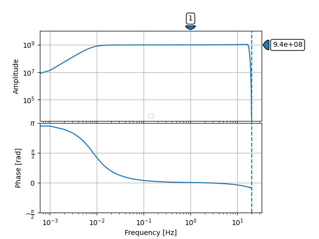

.. Put any comments here
   Be sure to indent at this level to keep it in comment.

As StationXML files are ordinary text files, they may be edited with
any text editor (e.g., vi/VIM, TextWrangler, Notepad/Wordpad, etc)

However, StationXML files can become very large and unwieldy as more
stations and channels are added.  For instance a regional seismic network
can generate a StationXML file of size > 30Mb on disk (>400,000 lines).

Fortunately, several tools exist that allow creation and editing of
StationXML files.

ObsPy + NRL
==============

ObsPy contains a number of very useful modules for working with StationXML.
In particular, ObsPy contain a module able to connect
to the IRIS Nominal Resource Library (NRL) and
download full responses (sensor + datalogger) for various combinations
of sensor + datalogger contained within the NRL.

The excerpts below provide examples of how to work with ObsPy and the NRL.

.. literalinclude:: examples/obspy/plot_response.py
  :language: python

The resulting response plot looks like

.. toggle-header::
    :header: Output for the response stages **Show/Hide Stages**

    .. literalinclude:: examples/obspy/plot_output.txt

Up until now we have been examining the response in ObsPy format, that is, as an instance
of type obspy.core.inventory.response.Response.

We can also examine this as part of a StationXML file, however, StationXML
does not allow children to exist without parents.  Thus, a response must
be contained within a <Channel> element, which itself must be contained
within a <Station> element, which must be contained within a <Network>
element, etc.

The excerpt below creates a generic structure to contain our Response object,
exports this to StationXML, and validates it against the StationXML schema.
Note at the time of this writting, ObsPy outputs StationXML 1.1 and does not
follow all of the recommendations in StationXML 1.1.1.

.. literalinclude:: examples/obspy/create_staxml.py
  :language: python

.. toggle-header::
    :header: The output StationXML file looks like:

    .. literalinclude:: examples/obspy/Test.xml
      :language: xml

IRIS SEED-StationXML Converter
====================================

IRIS maintains a Java-based tool that can convert between dataless SEED and StationXML formats at:

`<https://github.com/iris-edu/stationxml-seed-converter>`_

IRIS StationXML Validator
====================================

IRIS maintains a Java-based validator for StationXML documents.

Note: this tool validates documents against the official schema in addition
to a set of rules that are not possible to represent in the XML Schema language.

`<https://github.com/iris-edu/stationxml-validator>`_
