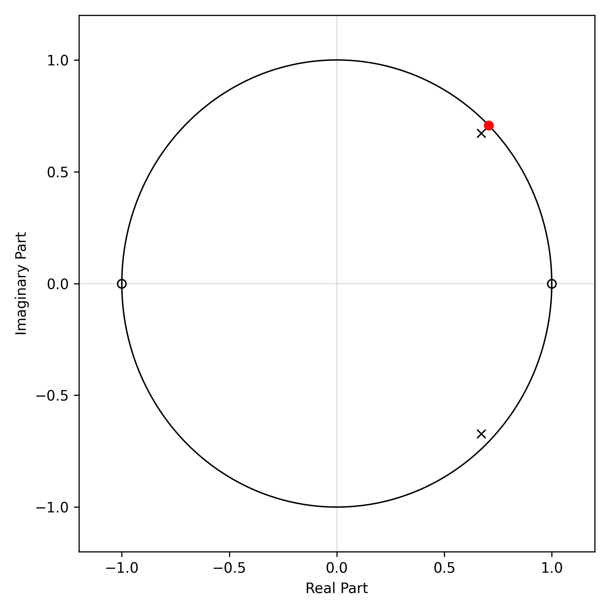
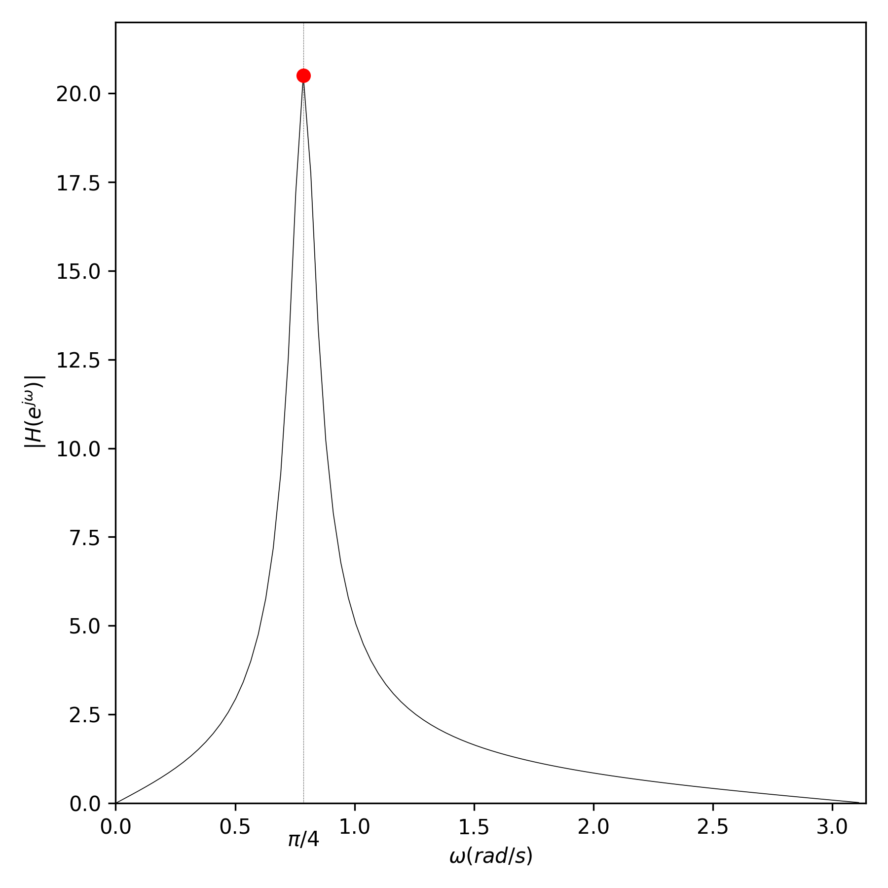
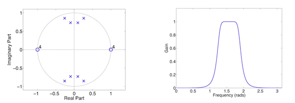

.. Put any comments here
   Be sure to indent at this level to keep it in comment.

Introduction
^^^^^^^^^^^^^^^^^^^^^

The z-Transform is defined by

.. math::

   X(z)=\sum_{n=0}^{\infty}x[n]z^{-n}

where

.. math::

   z=re^{j\omega}

   z^{-n}=r^{-n}e^{-j\omega n}

Notice that on the unit circle, where :math:`|z|\equiv |r|=1` and :math:`z=e^{j\omega}` , the z-transform reduces to the discrete Fourier transform (DTFT):

.. math::

   X(e^{j\omega})=\sum_{n=0}^{\infty}x[n]e^{-j\omega n}

The z-transform measures the similarity between the input signal :math:`x[n]`
and the signal :math:`z^{-n}`.

:math:`z^{-n}` represents exponentially increasing (for r < 0) or decreasing (r > 0)
sinusoids. e.g., :math:`e^{-j\omega n}` is a sinusoid with angular frequency
:math:`\omega` [radians/sample] that expands with sample number n.

Thus, the location (value) of :math:`z` in the complex plane controls what :math:`z^{-n}` looks like.

The fractional or angular frequency, :math:`\omega` [radians/sample] is related to the linear frequency
of the sinusoid through

.. math::

   2\pi[radians/cycle]=\omega[radians/sample]\cdot N[samples/cycle]

so the number of samples/cycle is given by

.. math::

   N=\frac{2\pi}{\omega}samples/cycle

and this corresponds to a period of :math:`T=N\Delta t` [seconds],

where :math:`\Delta t` is the sampling interval (secs) and is related to
the sampling rate by: :math:`f_{s}=\frac{1}{\Delta t}`.
Then the frequency of oscillation is given by :math:`f=\frac{1}{T}=\frac{1}{N\Delta t}=\frac{f_{s}}{N}` [Hz]

In other words, as the angle in the complex z-plane goes from :math:`\omega=0` to
:math:`\omega=\pi`, the linear frequency goes from :math:`f=0` to :math:`f=f_{Nyq}` [Hz],
where the *Nyquist* frequency, :math:`f_{Nyq}=\frac{f_s}{2}` [Hz].

Thus, in implementing the frequency response of the z-transform
(e.g., when calculating the response of a FIR filter), it is common
to write it in a way that removes the dependency on the actual sample rate, or

.. math::

   X(e^{j\omega})=\sum_{n=0}^{\infty}x[n]e^{-j 2\pi n \frac{f}{f_s}} = \sum_{n=0}^{\infty}x[n]e^{-j 2\pi n f \Delta t}

Difference Equations
^^^^^^^^^^^^^^^^^^^^^^

z-transforms of linear time-invariant (LTI) systems described by difference equations play
an important role in signal processing.

The general form of a difference equation is:.

.. math::

   \sum_{k=0}^{N}a_{k}y[n-k]=\sum_{k=0}^{M}b_{k}x[n-k],

where :math:`a_{0}\ne0` (the coefficient of y[n] can't be zero)

Taking the z-transform of both sides,

.. math::

   \sum_{k=0}^{N}a_{k}z^{-k}Y(z)=\sum_{k=0}^{M}b_{k}z^{-k}X(z)

or

.. math::

   Y(z)=\frac{\sum_{k=0}^{M}b_{k}z^{-k}}{\sum_{k=0}^{N}a_{k}z^{-k}}X(z)

From this we can write the system transfer function

.. math::

   H(z)=\frac{Y(z)}{X(z)}=\frac{\sum_{k=0}^{M}b_{k}z^{-k}}{\sum_{k=0}^{N}a_{k}z^{-k}}

The transfer function is the z-transform of the system impulse response, :math:`h[n]`, or

.. math::

   H(z)=\sum_{n=0}^{\infty}h[n]z^{-n}

The transfer function can also be factored in terms of poles and zeros (for :math:`b_{0}\ne0`)

.. math::

   H(z)=\frac{b_{0}}{a_{0}}\frac{\Pi_{k=1}^{M}(1-c_{k}z^{-1})}{\Pi_{k=1}^{N}(1-d_{k}z^{-1})}

where :math:`c_{k}` are the M zeros of the system, and :math:`d_{k}` are the N poles.

For a system to be both stable and causal, its poles must lie inside the unit circle, or
:math:`|d_{k}|<1` for :math:`k=1,N`.

z-Transform Frequency Response
^^^^^^^^^^^^^^^^^^^^^^^^^^^^^^^^^

How does the location of the poles and zeros of the z-transform influence the
complex frequency response, :math:`H(f)` ?

We start by only considering the magnitude response, :math:`|H(f)|`.

The z-transform only exists within a region of the complex z-plane where
the infinite sum [eqn X] converges. We call this region the
Radius of Convergence (ROC) of the system.

If our system, described by difference equations, is stable, then the ROC
must include the unit circle,
:math:`|z|=1` where

.. math::

   H(z)=\frac{Y(z)}{X(z)}=\frac{b_{0}}{a_{0}}\frac{\Pi_{k=1}^{M}(1-c_{k}z^{-1})}{\Pi_{k=1}^{N}(1-d_{k}z^{-1})}

   H(e^{-j\omega})=\frac{b_{0}}{a_{0}}\frac{\Pi_{k=1}^{M}(1-c_{k}e^{-j\omega})}{\Pi_{k=1}^{N}(1-d_{k}e^{-j\omega})}

The magnitude of the product is equal to the product of the magnitude, thus

.. math::
   :nowrap:

   \begin{eqnarray}
      |H(e^{-j\omega})| &=& \frac{|b_{0}|}{|a_{0}|}\frac{\Pi_{k=1}^{M}|(1-c_{k}e^{-j\omega})|}{\Pi_{k=1}^{N}|(1-d_{k}e^{-j\omega})|} \\
                        &=& \frac{|b_{0}|}{|a_{0}|}\frac{\Pi_{k=1}^{M}|e^{-j\omega}(e^{j\omega}-c_{k})|}{\Pi_{k=1}^{N}|e^{-j\omega}(e^{j\omega}-d_{k})|} \\
      |H(e^{-j\omega})| &=& \frac{|b_{0}|}{|a_{0}|}\frac{\Pi_{k=1}^{M}|(e^{j\omega}-c_{k})|}{\Pi_{k=1}^{N}|(e^{j\omega}-d_{k})|}
   \end{eqnarray}

In other words, as we traverse the unit circle through circular 'frequency', :math:`\omega`,
from :math:`0-2\pi`, the magnitude of the response depends on the distance between the point
on the unit circle, :math:`e^{j\omega}`, and the zeros, :math:`|e^{j\omega}-c_k|`, as well as
the distance between the point and the poles, :math:`|e^{j\omega}-d_k|`, or

.. math::

   |H(e^{-j\omega})| = \frac{|b_{0}|}{|a_{0}|}\frac{\Pi_{k=1}^{M}|distance-to-zeros|}{\Pi_{k=1}^{N}|distance-to-poles|}

Thus, :math:`|H(e^{j\omega})|` is small when :math:`e^{j\omega}` is near the zeros and
it is large when :math:`e^{j\omega}` is near the poles.

Examples
'''''''''''''''''

Example 1
""""""""""""
Consider a system with zeros at :math:`z=1,-1` and poles at :math:`z=0.95e^{\pm j\pi/4}`,
with response function

.. math::

   |H(e^{-j\omega})| = \frac{|(e^{j\omega}-1)||(e^{j\omega}+1)|} {|(e^{j\omega}-0.95e^{j\pi/4})||(e^{j\omega}-0.95e^{-j\pi/4})|}

Poles near the unit circle push the magnitude response up at those frequencies,
while zeros near the unit circle pull it down; if the zero is actually *on* the unit
circle, then it forces the magnitude response to be exactly 0 at that frequency.

Example 2
""""""""""""
Here's an example pass-band filter comprised of 8 poles and 8 zeros.
We can predict from the position of the poles and zeros that the
frequency response will be 0 at :math:`\omega=0` and will
be maximum near :math:`\omega=\frac{\pi}{2}`.

